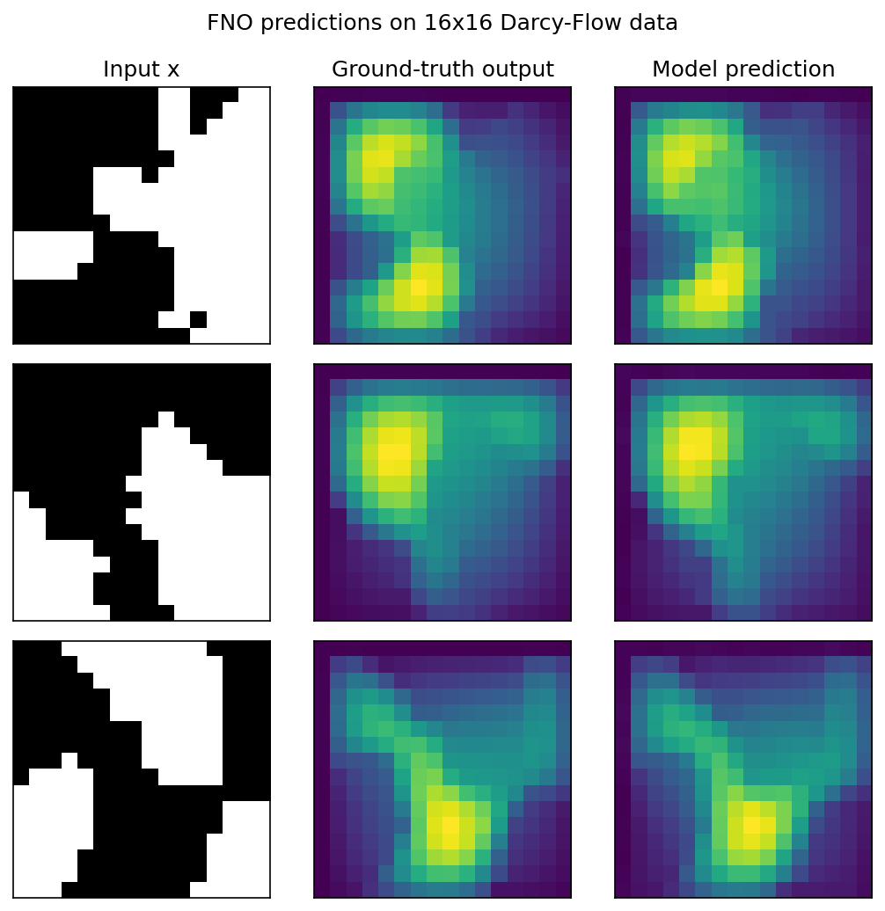

# 沐曦 GPU 运行 NeuralOperator 说明文档

## 一、NeuralOperator 简介

[NeuralOperator](https://github.com/NeuralOperator/neuraloperator) 是一个专门用于在PyTorch生态系统中学习和部署神经算子（Neural Operators）的开源Python库，旨在推动AI在科学和工程领域的应用，与学习有限维度向量或图像之间映射的传统神经网络不同，神经算子学习的是函数空间之间的映射，它可以直接学习从偏微分方程（PDEs）的参数、初始条件等函数，到其解函数之间的映射，从而为解决复杂的科学计算问题提供了全新的范式。

## 二、沐曦 GPU 环境配置

### 2.1 启动基础镜像

在宿主机进入本目录 `/work_2026/FluidDynamics/NeuralOperator` 后，使用沐曦开发者社区提供的 MACA PyTorch 2.4 基础镜像启动容器：

```bash
docker run -it --name test-NeuralOperator \
  --device=/dev/mxcd \
  --device=/dev/dri \
  --group-add video \
  --shm-size=8G \
  --security-opt seccomp=unconfined \
  --ulimit memlock=-1 \
  --ulimit stack=67108864 \
  -v "$(pwd):/workspace" \
  cr.metax-tech.com/public-library/maca-pytorch:3.7.2.1-torch2.4-py310-ubuntu22.04-amd64 \
  /bin/bash
```

参数说明：

- `--device=/dev/mxcd --device=/dev/dri`：挂载沐曦 GPU 设备。
- `--group-add video`：添加 `video` 组，使容器可以访问 GPU。
- `--shm-size=8G`：为数据加载和训练提供共享内存。
- `-v "$(pwd):/workspace"`：将宿主机当前目录挂载到容器的 `/workspace`。

后续命令如无特别说明，均在容器内执行。

### 2.2 验证基础环境

先确认基础镜像中的 PyTorch 未被替换，并能够识别沐曦 GPU：

```bash
python3 - <<'PY'
import torch

print("torch:", torch.__version__)
print("GPU available:", torch.cuda.is_available())
if torch.cuda.is_available():
    print("GPU count:", torch.cuda.device_count())
    print("GPU name:", torch.cuda.get_device_name(0))
PY
```

预期 `torch` 版本包含 `metax` 标识，且 `GPU available` 输出为 `True`。若为 `False`，应先检查宿主机驱动及启动容器时的设备挂载参数，不要继续安装模型。

## 三、安装 NeuralOperator

### 3.1 下载固定版本源码

```bash
cd /workspace
git clone https://github.com/NeuralOperator/neuraloperator.git
cd neuraloperator
git checkout 00b7d86f8d74ff0af55da53eb585fe26df9c71f0
```

固定 commit 可避免上游代码和依赖变化导致运行步骤失效。可执行以下命令确认当前版本：

```bash
git rev-parse HEAD
```

### 3.2 安装依赖和项目

基础镜像已经包含沐曦适配的 PyTorch，因此不要从 PyPI 重新安装 `torch`。先安装 NeuralOperator 的核心依赖：

```bash
pip3 install \
  "numpy>=1.25" \
  configmypy \
  h5py \
  matplotlib \
  opt-einsum \
  ruamel.yaml \
  tensorly \
  tensorly-torch \
  wandb \
  zarr \
  zencfg 
```

再安装 NeuralOperator 本体。`--no-deps` 用于防止安装过程覆盖基础镜像中的 MACA PyTorch：

```bash
cd /workspace/neuraloperator
pip3 install --no-deps -e .
```

检查安装结果：

```bash
python3 - <<'PY'
import torch
import neuralop

print("torch:", torch.__version__)
print("neuralop:", neuralop.__version__)
print("GPU available:", torch.cuda.is_available())
PY
```

## 四、模型训练

### 4.1 FNO 模型前向验证

先运行一个不依赖数据集的最小 FNO 前向计算，确认模型能够在 GPU 上执行：

```bash
cd /workspace/neuraloperator
python3 - <<'PY'
import torch
from neuralop.models import FNO

assert torch.cuda.is_available(), "GPU is unavailable"
device = torch.device("cuda:0")
model = FNO(
    n_modes=(4, 4),
    hidden_channels=8,
    in_channels=1,
    out_channels=1,
).to(device)
x = torch.randn(1, 1, 16, 16, device=device)
with torch.no_grad():
    y = model(x)
print("device:", y.device)
print("output shape:", tuple(y.shape))
assert y.shape == x.shape
print("FNO GPU forward: OK")
PY
```

预期输出包含 `device: cuda:0`、`output shape: (1, 1, 16, 16)` 和 `FNO GPU forward: OK`。

### 4.2 FNO 模型训练

该脚本首次运行时会自动下载小型 Darcy Flow 数据集，需要保证容器能够访问网络。容器通常没有图形界面，使用非交互式 Matplotlib 后端运行。由于该脚本默认使用 CPU，需要先将设备配置改为 `cuda` 以验证沐曦 GPU。编辑 `/workspace/neuraloperator/examples/models/plot_FNO_darcy.py`，将：

```python
device = "cpu"
```

修改为：

```python
device = "cuda"
```

确认修改结果并运行测试：

```bash
grep -n '^device =' examples/models/plot_FNO_darcy.py
cd /workspace/neuraloperator
MPLBACKEND=Agg python3 examples/models/plot_FNO_darcy.py 
```

该命令完成以下过程：

1. 加载 Darcy Flow 训练集和测试集。
2. 创建二维 FNO 模型并在 GPU 上训练 15 个 epoch。
3. 使用 H1/L2 Loss 评估模型。
4. 执行常规分辨率预测和零样本超分辨率预测。

预期 `grep` 输出为 `device = "cuda"`，训练日志能够正常输出 epoch、训练 loss 和测试 loss，并完成 16x16 与 32x32 两个分辨率的预测。该脚本固定训练 15 个 epoch，可在代码中修改训练的epoch数量。

### 4.3 预测结果可视化

训练完成后，`plot_FNO_darcy.py `脚本会对测试集样本进行推理并且进行可视化处理，生成预测值与真实值的对比图。



上图是模型训练完成后在测试集上的推理结果，每行依次展示输入、真实输出与模型预测，用于直观对比预测值与真实值的差异。

## 五、常见问题与注意事项

### 5.1 安装后 MACA PyTorch 被覆盖

不要直接执行可能解析并重装全部依赖的安装命令。本文先显式安装不含 `torch` 的核心依赖，再使用：

```bash
pip3 install --no-deps -e .
```

安装完成后再次检查 `torch.__version__`，其版本应仍包含 `metax` 标识。

### 5.2 Matplotlib 无法显示窗口

容器没有桌面环境时使用：

```bash
export MPLBACKEND=Agg
```

需要保存预测图片时，可在示例代码的 `fig.show()` 前增加 `fig.savefig(...)`，并将图片保存到 `/workspace/output`。

### 5.3 GPU 模式下教程脚本绘图报错

教程脚本官方代码在 GPU 模式下末尾绘图会直接对 CUDA 张量调用 `imshow`，报 `TypeError: can't convert cuda:0 device type tensor to numpy`。需将绘图处的 `x[0]`、`y.squeeze()`、`out.squeeze()` 转回 CPU，即在 `imshow` 参数中加上 `.cpu().detach().numpy()`。

### 5.4 使用 Dockerfile 构建（可选）

本目录的 `Dockerfile` 将上述环境准备过程固化为镜像。完成逐步运行验证后，如需复用环境，可在宿主机的本目录执行：

```bash
docker build -t neuraloperator-maca .
```

启动构建后的镜像：

```bash
docker run --rm -it \
  --name neuraloperator \
  --device=/dev/mxcd \
  --device=/dev/dri \
  --group-add video \
  --shm-size=8G \
  --security-opt seccomp=unconfined \
  --ulimit memlock=-1 \
  --ulimit stack=67108864 \
  neuraloperator-maca
```

## 六、参考资料

1. [NeuralOperator 官方仓库](https://github.com/NeuralOperator/neuraloperator)
2. [NeuralOperator 官方文档](https://neuraloperator.github.io/dev/)
3. [Fourier Neural Operator 论文](https://arxiv.org/abs/2010.08895)
4. [沐曦开发者社区](https://developer.metax-tech.com/)

---

本文档仅提供相关软件的配置与使用说明，不包含亦不分发前述软件的源代码或目标代码，且不涉及对其源代码的任何修改。您按照本文档配置、部署或使用相关软件时，应遵守适用许可证规定的条款及条件。相关软件的源代码、许可证全文、版权与归属声明及其他项目文档，请以其官方网站或原始发布页面为准。

Copyright (c) 2026 MetaX Integrated Circuits (Shanghai) Co., Ltd. All rights reserved.
