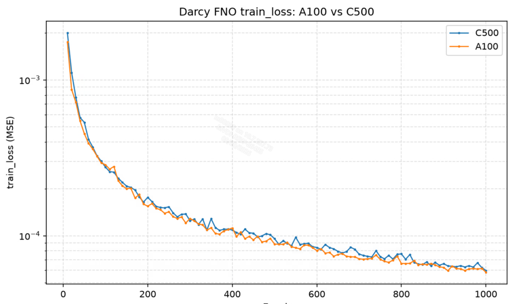

# 沐曦 GPU 运行 PINA 说明文档

[PINA](https://github.com/mathLab/PINA)项目由第三方以开源许可证发布，我方未对其源代码作任何修改。您可通过以下链接 https://github.com/mathLab/PINA 查阅该项目的源代码、许可证全文、版权与归属声明及其他声明文件。

## 一、PINA 简介

[PINA](https://github.com/mathLab/PINA) 是 mathLab 开源的科学机器学习（Scientific Machine Learning，SciML）框架。它基于 PyTorch 和 Lightning，提供问题定义、模型构建、求解器和训练器等模块，可用于物理信息神经网络（PINN）、数据驱动建模、降阶建模以及偏微分方程求解。

本文档说明如何在沐曦（MetaX）C500 GPU 上构建 PINA 环境，并以二维 Darcy 流教程为例验证训练。同时汇总已完成的流体及 PDE 相关教程测试结果和 GPU 适配注意事项。

## 二、沐曦GPU环境配置与运行

### 2.1 环境准备

使用沐曦开发者社区提供的 [MACA torch2.4镜像](https://developer.metax-tech.com/softnova/docker?chip_name=%E6%9B%A6%E4%BA%91C500%E7%B3%BB%E5%88%97&package_name=torch&dimension=docker&deliver_type=%E5%88%86%E5%B1%82%E5%8C%85)：

```bash
docker run -it --name test-PINA \
  --device=/dev/mxcd \
  --device=/dev/dri \
  --group-add video \
  --shm-size=4G \
  --security-opt seccomp=unconfined \
  --ulimit memlock=-1 \
  --ulimit stack=67108864 \
  -v /host_dir:/workspace \
  cr.metax-tech.com/public-library/maca-pytorch:3.7.2.1-torch2.4-py310-ubuntu22.04-amd64 \
  /bin/bash
```

> 可根据需要使用更新版本镜像，详情参见[沐曦开发者社区](https://developer.metax-tech.com)。

**参数说明：**

- `--device=/dev/mxcd --device=/dev/dri`：挂载沐曦GPU设备
- `--group-add video`：添加video组以访问GPU
- `--shm-size=4G`：设置共享内存大小
- `-v`：挂载工作目录，`host_dir` 为主机端目录，`workspace` 为容器内目录

### 2.2 验证环境

进入容器后，验证torch环境：

```bash
pip list | grep torch
```

输出显示已安装沐曦定制版torch：

```text
torch                     2.4.0+metax3.7.2.0
```

### 2.3 安装PINA

**PINA 代码下载：**

下载`master`分支代码，切换到已验证的`commit-id`版本：

```bash
cd /workspace
git clone https://github.com/mathLab/PINA.git
cd PINA
git checkout 60ea474a95e0aa8aa44212c094b8d92ee14b125f
```

**PINA 安装：**

基础镜像已经包含沐曦定制版torch。先安装其余运行和教程依赖，再使用`--no-deps`安装PINA，避免通用PyTorch覆盖MACA版本：

```bash
pip install \
  "lightning==2.6.5" \
  matplotlib \
  numpy \
  scipy \
  smithers \
  tensorboard \
  "transformers==4.45.2" \
  torch-geometric 

pip install --no-deps -e .
pip list | grep pina-mathlab
```

输出显示`pina-mathlab 0.3.2`即安装成功。

## 三、模型训练

### 3.1 训练环境验证

进入容器后执行：

```bash
python3 - <<'PY'
from importlib.metadata import version
import torch
import lightning
import torch_geometric
import pina

print("PINA:", version("pina-mathlab"), pina.__file__)
print("PyTorch:", torch.__version__)
print("Lightning:", lightning.__version__)
print("PyG:", torch_geometric.__version__)
print("GPU available:", torch.cuda.is_available())
print("GPU count:", torch.cuda.device_count())
if torch.cuda.is_available():
    print("GPU name:", torch.cuda.get_device_name(0))
PY
```

预期 `GPU available` 为 `True`，设备名称包含 `MetaX C500`。随后执行最小前向/反向测试：

```bash
python3 - <<'PY'
import torch
from pina.model import FeedForward

assert torch.cuda.is_available(), "GPU 不可用，请检查设备挂载和驱动"
device = torch.device("cuda:0")
model = FeedForward(
    input_dimensions=2,
    output_dimensions=1,
    layers=[16, 16],
).to(device)
x = torch.randn(32, 2, device=device, requires_grad=True)
loss = model(x).square().mean()
loss.backward()
torch.cuda.synchronize()
print("device:", torch.cuda.get_device_name(0))
print("forward/backward: OK, loss =", loss.item())
PY
```

### 3.2 Darcy 流训练

将 `tutorial5` 中的 Lightning `accelerator` 从 `"cpu"` 改为 `"gpu"`。修改 `/workspace/PINA/tutorials/tutorial5/tutorial.py` 中 FNO 模型对应的 `Trainer` 配置，将训练轮数设置为 1000：

```python
trainer = Trainer(
    solver=solver,
    max_epochs=1000,
    accelerator="gpu",
    # 其他参数保持不变
)
```

```bash
cd /workspace/PINA/tutorials/tutorial5
MPLBACKEND=Agg python3 tutorial.py \
  2>&1 | tee /workspace/output/tutorial5.log
```

将训练轮数设置为 1000 后，C500 训练残差整体下降，最终 `train_loss` 约为 `5.994736e-05`。



## 四、GPU 适配注意事项

### 4.1 绘图前将张量移到 CPU

GPU 训练后，求解结果和回调记录可能仍在设备上。Matplotlib 不能直接转换 GPU 张量，绘图前应统一处理：

```python
values = values.detach().cpu()
plt.plot(values)
```

否则可能出现：

```text
TypeError: can't convert cuda:0 device type tensor to numpy
```

该问题会影响 `tutorial3`、`tutorial9` 等包含训练后绘图的案例。

### 4.2 新张量应继承输入设备和类型

不要在模型 `forward` 中创建固定在 CPU 的张量。`tutorial24` 的常量输入应采用：

```python
t = torch.full(
    (x.shape[0], 1),
    0.5,
    dtype=x.dtype,
    device=x.device,
)
```

否则 GPU 训练会报 `Expected all tensors to be on the same device`。

### 4.3 PINA 0.3.2 API 变化

`tutorial3` 使用波动方程时，应从 `pina.equation.zoo` 导入新接口：

```python
from pina.equation import Equation
from pina.equation.zoo import FixedValue, AcousticWaveEquation

wave_equation = AcousticWaveEquation(c=1.0)
```

离散全部计算域时显式传入域名：

```python
problem.discretise_domain(
    1000,
    "random",
    domains=["D", "initial", "boundary"],
)
```

### 4.4 不要覆盖 MACA PyTorch

基础镜像提供沐曦定制 PyTorch。安装额外包后应检查：

```bash
python3 -c 'import torch; print(torch.__version__)'
```

如果版本不再是基础镜像提供的 MACA 版本，应重新构建镜像。安装 PINA 本体时应保留 Dockerfile 中的 `pip install --no-deps -e .`。

## 五、常见问题

### Lightning 导入时报 `device_mesh` 不存在

如果出现以下错误：

```text
ModuleNotFoundError: No module named 'torch.distributed.tensor.device_mesh'
```

说明环境中的新版 `transformers` 与基础镜像提供的 MACA PyTorch 2.4 不兼容。PINA 本体通常已经安装成功，报错发生在 `lightning -> torchmetrics -> transformers` 导入链。请在已有容器中固定兼容版本：

```bash
pip install "transformers==4.45.2" \
  -i https://pypi.tuna.tsinghua.edu.cn/simple

python3 -c "import torch, lightning, torch_geometric, pina; print(torch.__version__); print('PINA imports: OK')"
```

安装时会同时将 `tokenizers` 调整到 `transformers==4.45.2` 所需的兼容版本。修复后无需重新安装 PINA。

### Dockerfile build

在本目录构建包含PINA源码和教程依赖的镜像：

```bash
cd /work_2026/FluidDynamics/PINA
docker build -t pina-maca:0.3.2 .
```

构建完成后，使用第二章中的GPU设备参数启动镜像，并将末尾的基础镜像名称替换为`pina-maca:0.3.2`。

### `torch.cuda.is_available()` 返回 `False`

检查宿主机驱动、`mx-smi` 输出，以及 `docker run` 是否包含 `/dev/mxcd`、`/dev/dri` 和 `video` 用户组参数。

### 容器内绘图失败

保持 `MPLBACKEND=Agg`。Dockerfile 已默认设置该环境变量，手工运行其他环境时可执行：

```bash
export MPLBACKEND=Agg
```

### 数据下载失败

部分教程在数据缺失时会从 GitHub 下载文件。网络受限时，可预先下载数据并挂载到对应教程目录。数据不在 Docker 构建阶段额外下载，以免网络波动导致镜像构建失败。


## 六、参考资料

- [PINA 官方仓库](https://github.com/mathLab/PINA)
- [PINA 官方文档](https://mathlab.github.io/PINA/)
- [PINA 安装文档](https://github.com/mathLab/PINA/blob/master/docs/source/_installation.rst)
- [PINA MIT License](https://github.com/mathLab/PINA/blob/master/LICENSE.rst)
- [沐曦开发者社区](https://developer.metax-tech.com/)

---

本文档仅提供相关软件的配置与使用说明，不包含亦不分发前述软件的源代码或目标代码，且不涉及对其源代码的任何修改。您按照本文档配置、部署或使用相关软件时，应遵守适用许可证规定的条款及条件。相关软件的源代码、许可证全文、版权与归属声明及其他项目文档，请以其官方网站或原始发布页面为准。

Copyright (c) 2026 MetaX Integrated Circuits (Shanghai) Co., Ltd. All rights reserved.
