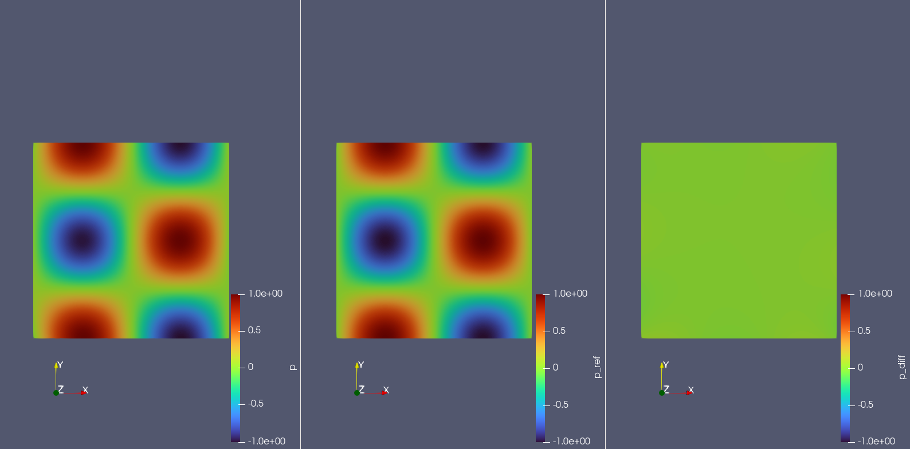

# 沐曦GPU运行PaddleScience说明文档

[PaddleScience](https://paddlescience.readthedocs.io/en/latest/)项目由第三方以开源许可证发布，我方未对其源代码作任何修改。您可通过以下链接 https://paddlescience.readthedocs.io/en/latest 查阅该项目的源代码、许可证全文、版权与归属声明及其他声明文件。

## 一、PaddleScience简介

[PaddleScience](https://paddlescience.readthedocs.io/en/latest/)是一个基于深度学习框架 PaddlePaddle 开发的科学计算套件，利用深度神经网络的学习能力和 PaddlePaddle 框架的自动(高阶)微分机制，解决物理、化学、气象等领域的问题。支持物理机理驱动、数据驱动、数理融合三种求解方式，并提供了基础 API 和详尽文档供用户使用与二次开发。[PaddleScience 仓库](https://github.com/paddlepaddle/paddlescience)下载最新代码。

## 二、沐曦GPU环境配置与运行

### 2.1 环境准备

使用沐曦开发者社区提供的[MACA Paddle2.6/Paddle3.0镜像](https://developer.metax-tech.com/softnova/docker?chip_name=%E6%9B%A6%E4%BA%91C500%E7%B3%BB%E5%88%97&package_name=paddle&dimension=docker&deliver_type=%E5%88%86%E5%B1%82%E5%8C%85)：  

```bash
docker run -it --name test-PaddleScience \
  --device=/dev/mxcd \
  --device=/dev/dri \
  --group-add video \
  --shm-size=4G \
  --security-opt seccomp=unconfined \
  --ulimit memlock=-1 \
  --ulimit stack=67108864 \
  -v /host_dir:/workspace \
  cr.metax-tech.com/public-ai-release/maca/paddle:2.6.0-maca.ai3.7.0.6-py310-ubuntu22.04-amd64 \
  /bin/bash
```
> 可根据需要使用更新版本镜像，详情参见[沐曦开发者社区](https://developer.metax-tech.com)

**参数说明：**
- `--device=/dev/mxcd --device=/dev/dri`：挂载沐曦GPU设备
- `--group-add video`：添加video组以访问GPU
- `--shm-size=4G`：设置共享内存大小
- `-v`：挂载工作目录，`host_dir` 为主机端目录，`workspace`为容器内目录

### 2.2 验证环境

进入容器后，验证paddle环境：

```bash
pip list | grep paddle
```

输出显示已安装沐曦定制版paddle：
```
paddlepaddle-gpu        2.6.0+maca3.7.0.6
```

### 2.3 安装PaddleScience

**PaddleScience 代码下载：**
```bash
git clone https://github.com/PaddlePaddle/PaddleScience.git
git checkout 132e46728907be147696b0d4fbafb8167834a707
```

**PaddleScience 安装：**
运行如下命令后，显示`paddlesci`证明安装成功
```bash
pip install . -i https://pypi.tuna.tsinghua.edu.cn/simple
pip list | grep paddlesci
```

## 三、PaddleScience 案例
[PaddleScience 官网](https://paddlescience.readthedocs.io/en/latest/)官网案例包括“数学”、“技术科学”、“材料科学”、“地球科学”、“化学科学” 分类，每个案例都有详细的教程，本文以```2D-Darcy```案例作为示例介绍PaddleScience如何训练及推理。

### 2D-Darcy

#### 简介
Darcy Flow是一个基于达西定律的工具，用于计算液体的流动。在地下水模拟、水文学、水文地质学和石油工程等领域中，Darcy Flow被广泛应用。例如，在石油工程中，Darcy Flow被用来预测和模拟石油在多孔介质中的流动。多孔介质是一种由小颗粒组成的物质，颗粒之间存在空隙。石油会填充这些空隙并在其中流动。通过Darcy Flow，工程师可以预测和控制石油的流动，从而优化石油开采和生产过程。此外，Darcy Flow也被用于研究和预测地下水的流动。例如，在农业领域，通过模拟地下水流动可以预测灌溉对土壤水分的影响，从而优化作物灌溉计划。在城市规划和环境保护中，Darcy Flow也被用来预测和防止地下水污染。2D-Darcy 是达西渗流（Darcy flow）的一种，流体在多孔介质中流动时，渗流速度小，流动服从达西定律，渗流速度和压力梯度之间呈线性关系，这种流动称为线性渗流。
#### 模型训练命令
```
python darcy2d.py
```
#### 模型评估命令
`darcy2d_pretrained.pdparams`为上一步训练的模型权重
```
python darcy2d.py mode=eval EVAL.pretrained_model_path=https://paddle-org.bj.bcebos.com/paddlescience/models/darcy2d/darcy2d_pretrained.pdparams
```

#### 模型导出命令
```
python darcy2d.py mode=export
```

#### 模型推理命令
```
python darcy2d.py mode=infer
```

#### 后处理

展示了模型对正方形计算域中每个点的压力p、x(水平)方向流速u、y(垂直)方向流速的预测结果、参考结果以及两者之差。


## 四、常见问题与注意事项
已适配的案例请见[多硬件支持](https://paddlescience-docs.readthedocs.io/zh-cn/latest/multi_device/)
### Dockerfile build
```
docker build -t pdsci-maca .
```
## 五、其他
1. 开发者在初次使用曦云GPU运行PaddleScience时，遵循本手册搭建环境后，就可以按照[PaddleScience 官网](https://paddlescience.readthedocs.io/en/latest/)的教程开始训练及推理
2. 沐曦仅维护部分case的正确性，如出现运行问题，可提交issue，亦可以在开发者社区提交bug反馈
3. 了解更多沐曦开源项目，请参考[沐曦开源社区](https://github.com/metax-maca)

---

本文档仅提供相关软件的配置与使用说明，不包含亦不分发前述软件的源代码或目标代码，且不涉及对其源代码的任何修改。您按照本文档配置、部署或使用相关软件时，应遵守适用许可证规定的条款及条件。相关软件的源代码、许可证全文、版权与归属声明及其他项目文档，请以其官方网站或原始发布页面为准。

Copyright (c) 2026 MetaX Integrated Circuits (Shanghai) Co., Ltd. All rights reserved.
