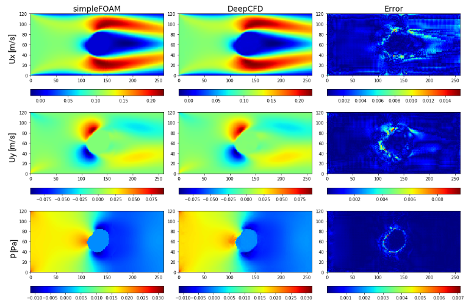

# 沐曦GPU运行DeepCFD说明文档

## 一、DeepCFD简介

[DeepCFD](https://github.com/mdribeiro/DeepCFD)通过数值求解纳维 - 斯托克斯方程开展计算流体力学（CFD）仿真，是工程设计、气候模拟等众多领域不可或缺的手段。但针对气动外形优化等实际流动问题，传统 CFD 程序会产生极高的计算开销与内存占用。流体控制方程包含难以求解的非线性偏微分项，这一特性大幅提升了运算成本，不仅导致计算耗时久，也限制了迭代设计过程中可验证的方案数量。为此，本文提出DeepCFD模型：一种基于卷积神经网络（CNN）的模型，可高效求解非均匀稳态层流问题。该模型依托主流 CFD 程序生成的真实样本数据，直接学习纳维 - 斯托克斯方程的完整解，同时输出速度场与压力场。实测表明，DeepCFD 相较传统 CFD 方法运算速度提升三个数量级，且误差水平较低。
## 二、沐曦GPU环境配置与运行

### 2.1 环境准备

使用沐曦开发者社区提供的[MACA torch2.4镜像]([4](https://developer.metax-tech.com/softnova/docker?chip_name=%E6%9B%A6%E4%BA%91C500%E7%B3%BB%E5%88%97&package_name=torch&dimension=docker&deliver_type=%E5%88%86%E5%B1%82%E5%8C%85))：
```bash
docker run -it --name test-DeepCFD \
  --device=/dev/mxcd \
  --device=/dev/dri \
  --group-add video \
  --shm-size=4G \
  --security-opt seccomp=unconfined \
  --ulimit memlock=-1 \
  --ulimit stack=67108864 \
  -v /host_dir:/workspace \
  cr.metax-tech.com/public-library/maca-pytorch:3.7.2.1-torch2.4-py310-ubuntu22.04-amd64 \
  /bin/bash
```
> 可根据需要使用更新版本镜像，详情参见[沐曦开发者社区](https://developer.metax-tech.com)

**参数说明：**
- `--device=/dev/mxcd --device=/dev/dri`：挂载沐曦GPU设备
- `--group-add video`：添加video组以访问GPU
- `--shm-size=4G`：设置共享内存大小
- `-v`：挂载工作目录，`host_dir` 为主机端目录，`workspace`为容器内目录

### 2.2 验证环境

进入容器后，验证torch环境：

```bash
pip list | grep torch
```

输出显示已安装沐曦定制版torch：
```
torch                     2.4.0+metax3.7.2.0
```

### 2.3 安装DeepCFD

**DeepCFD 代码下载：**
下载`master`分支最新代码，切换到指定`commit-id`版本
```bash
git clone https://github.com/mdribeiro/DeepCFD.git
git checkout f9cc152fe1190895cdeb18b102c2640bc5587deb
```

**DeepCFD 安装：**
运行如下命令后，显示`deepcfd`证明安装成功
```bash
pip install . -i https://pypi.tuna.tsinghua.edu.cn/simple
pip list | grep deepcfd
```

## 三、DeepCFD 训练

### 数据及下载

你可通过[链接](https://zenodo.org/record/3666056/files/DeepCFD.zip?download=1)下载本项目的简易数据集与配套代码。压缩包内包含 dataX 和 dataY 两个文件：其中 dataX 存储 981 组通道流样本的几何结构输入信息；dataY 则是借助 simpleFOAM 求解器得到的对应标准计算流体力学仿真结果，包含流向速度（Ux）、法向速度（Uy）以及压力场（p）的真实解。下面训练命令中的`dataX.pkl`与`dataY.pkl`为数据集文件，需要根据实际的目录进行配置。
### 用法
```
Usage:  python3 -m deepcfd [OPTIONS]

Options:
    -d, --device        TEXT  device: 'cpu', 'cuda', 'cuda:0', 'cuda:0,cuda:1' (default: cuda if available)
    -n, --net           TEXT  network architecture: UNetEx or AutoEncoder (default: UNetEx)
    -mi, --mmodel-input PATH  input dataset with sdf1,flow-region and sdf2 fields (default: dataX.pkl)
    -mo, --model-output PATH  output dataset with Ux,Uy and p (default: dataY.pkl)
    -o, --output        PATH  model output (default: mymodel.pt)
    -k, --kernel-size   INT   kernel size (default: 5)
    -f, --filters       TEXT  filter size (default: 8,16,32,32)
    -l, --learning-rate FLOAT learning rage (default: 0.001)
    -e, --epochs        INT   number of epochs (default: 1000)
    -b, --batch-size    INT   training batch size (default: 32)
    -p, --patience      INT   number of epochs for early stopping (default: 300)
    -v, --visualize           flag for visualizing ground-truth vs prediction plots (default: False)


Example:

python3 -m deepcfd \
        --net UNetEx \
        --model-input DeepCFD/dataX.pkl \
        --model-output DeepCFD/dataY.pkl \
        --output DeepCFD/${name}.pt \
        --kernel-size 5 \
        --filters 8,16,32,32 \
        --epochs 2000 \
        --batch-size 32 > log.deepcfd
```

### 后处理
DeepCFD 模型与 OpenFOAM 基准的流场可视化对比，用来直观展示深度学习模型对流体仿真结果的预测精度


## 四、常见问题与注意事项
无
### Dockerfile build
```
docker build -t deepcfd-maca .
```
## 五、其他
1. 开发者在初次使用曦云GPU运行DeepCFD时，遵循本手册搭建环境后，就可以按照[DeepCFD 官网](https://github.com/mdribeiro/DeepCFD)的教程开始训练及推理
2. 沐曦仅维护部分case的正确性，如出现运行问题，可提交issue，亦可以在开发者社区提交bug反馈
3. 了解更多沐曦开源项目，请参考[沐曦开源社区](https://github.com/metax-maca)

---

本文档仅提供相关软件的配置与使用说明，不包含亦不分发前述软件的源代码或目标代码，且不涉及对其源代码的任何修改。您按照本文档配置、部署或使用相关软件时，应遵守适用许可证规定的条款及条件。相关软件的源代码、许可证全文、版权与归属声明及其他项目文档，请以其官方网站或原始发布页面为准。

Copyright (c) 2026 MetaX Integrated Circuits (Shanghai) Co., Ltd. All rights reserved.

